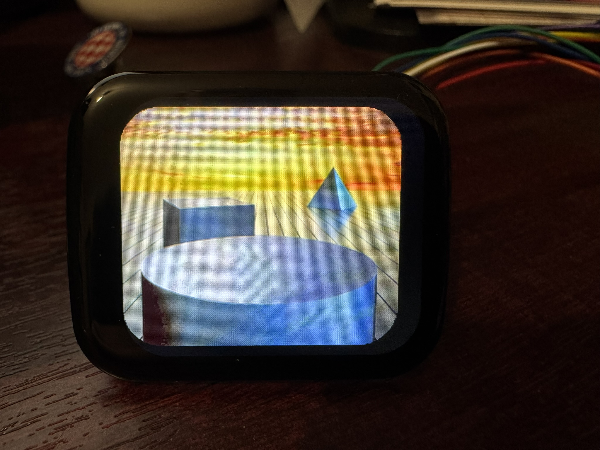

This is code to use the Waveshare 1.69" LCD module (https://www.waveshare.com/1.69inch-lcd-module.htm?srsltid=AfmBOoqnq4vozBZfUOnangHWTjYbid3DhiIjLID99uCzbjYkxSxJlfdm) as a simple image viewer.

Image files should be converted to RGB65 format using the converter tool and saved on the Pico with .wav extension.

The converter rotates, scales and offsets the image to be shown with the display in landscape mode and centred with respect to the physical device shape, meaning there is an unused border to the right as the LCD is not centred with respect to the physical device.

 
